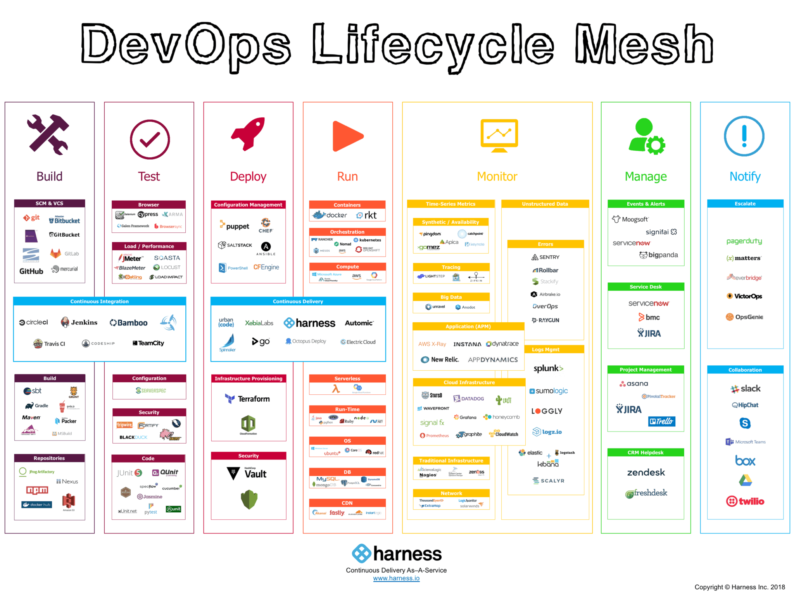

# DevOps Tools Ecosystem

## 🛠️ Tool Categories

DevOps tools được chia thành nhiều categories tương ứng với từng giai đoạn trong DevOps lifecycle.



## 📋 Category Deep Dive

### **1. Version Control**

| Tool | Type | Description | Market Share |
|------|------|-------------|--------------|
| **Git** | VCS | Distributed version control | 94% |
| **GitHub** | Platform | Git hosting + CI/CD + collaboration | 40% |
| **GitLab** | Platform | Complete DevOps platform | 30% |
| **Bitbucket** | Platform | Git + CI/CD by Atlassian | 20% |

**Recommended**: Git + GitHub/GitLab

### **2. CI/CD Platforms**

| Tool | Type | Strength | Best For |
|------|------|----------|----------|
| **Jenkins** | Self-hosted | Highly customizable, plugins | On-premise, complex |
| **GitLab CI** | Cloud/Self | Integrated with GitLab | Full lifecycle |
| **GitHub Actions** | Cloud | GitHub integration | GitHub users |
| **CircleCI** | Cloud | Fast, easy setup | Cloud-native |
| **Azure DevOps** | Cloud/Self | Microsoft ecosystem | Enterprise |
| **ArgoCD** | GitOps | Kubernetes native | K8s deployments |

**Recommended Combo**:
- Small teams: GitHub Actions
- Enterprise: GitLab CI or Azure DevOps
- Kubernetes: ArgoCD + Jenkins/GitLab

### **3. Containerization & Orchestration**

#### **Container Runtimes**

```
Docker (70%) > Podman (15%) > containerd (10%) > CRI-O (5%)
```

| Tool | Pros | Cons |
|------|------|------|
| **Docker** | Easy, popular, great docs | Daemon requirement |
| **Podman** | Daemonless, rootless | Smaller ecosystem |
| **containerd** | Lightweight, K8s native | Less features |

#### **Container Orchestration**

```
Kubernetes (80%) > Docker Swarm (10%) > Nomad (5%) > Others (5%)
```

**Kubernetes Distributions:**
- **Vanilla K8s**: Full control, complex
- **K3s**: Lightweight, IoT/Edge
- **OpenShift**: Enterprise, Red Hat
- **Rancher**: Multi-cluster management
- **EKS/GKE/AKS**: Managed services

### **4. Infrastructure as Code (IaC)**

| Tool | Type | Language | Cloud Focus | Learning Curve |
|------|------|----------|-------------|----------------|
| **Terraform** | Declarative | HCL | Multi-cloud | Medium |
| **Ansible** | Procedural | YAML | Agnostic | Low |
| **CloudFormation** | Declarative | JSON/YAML | AWS only | Medium |
| **Pulumi** | Imperative | Python/TypeScript | Multi-cloud | Medium-High |
| **Chef** | Procedural | Ruby DSL | Agnostic | High |
| **Puppet** | Declarative | Puppet DSL | Agnostic | High |

**Recommended**:
- **General**: Terraform (infrastructure) + Ansible (config)
- **AWS only**: CloudFormation
- **Programming lovers**: Pulumi

### **5. Monitoring & Observability**

#### **Metrics**

| Tool | Type | Best For | Cost |
|------|------|----------|------|
| **Prometheus** | Open-source | K8s, time-series | Free |
| **Datadog** | SaaS | All-in-one APM | $$$ |
| **New Relic** | SaaS | APM, distributed tracing | $$$ |
| **Grafana** | Open-source | Visualization | Free |

#### **Logging**

| Stack | Components | Complexity | Cost |
|-------|-----------|------------|------|
| **ELK** | Elasticsearch + Logstash + Kibana | High | Free/Expensive |
| **PLG** | Prometheus + Loki + Grafana | Medium | Free |
| **Splunk** | All-in-one | Low | $$$$ |

#### **Tracing**

- **Jaeger**: Open-source, CNCF, K8s-native
- **Zipkin**: Older, simpler
- **AWS X-Ray**: AWS services
- **Datadog APM**: Commercial, comprehensive

**Recommended Stack**:
```
Prometheus (Metrics) + Loki (Logs) + Grafana (Viz) + Jaeger (Traces)
= PLG + J (Complete, Free, Powerful)
```

### **6. Security Tools**

#### **Container Security**

| Tool | Type | Function |
|------|------|----------|
| **Trivy** | Scanner | Vulnerability scanning |
| **Clair** | Scanner | Container analysis |
| **Falco** | Runtime | Runtime security |
| **Aqua** | Platform | Complete security |

#### **Code Security**

| Tool | Type | Function |
|------|------|----------|
| **SonarQube** | SAST | Code quality + security |
| **Snyk** | SCA | Dependency scanning |
| **GitLab Security** | Integrated | SAST, DAST, dependency |
| **Checkmarx** | SAST | Enterprise code scanning |

#### **Secrets Management**

- **HashiCorp Vault**: Industry standard
- **AWS Secrets Manager**: AWS integration
- **Azure Key Vault**: Azure integration
- **Sealed Secrets**: Kubernetes-native

### **7. Cloud Platforms**

| Platform | Market Share | Strengths | Best For |
|----------|--------------|-----------|----------|
| **AWS** | 32% | Comprehensive services | Enterprises, startups |
| **Azure** | 23% | Microsoft integration | .NET, hybrid |
| **GCP** | 10% | Data & ML, Kubernetes | Data-heavy, K8s |
| **Others** | 35% | Various | Specific needs |

### **8. Collaboration & Communication**

#### **Chat**

- **Slack**: Most popular, great integrations
- **Microsoft Teams**: Office 365 integration
- **Discord**: Developer communities
- **Mattermost**: Open-source, self-hosted

#### **Project Management**

- **Jira**: Industry standard, powerful
- **Azure Boards**: DevOps integration
- **Linear**: Modern, fast
- **Trello**: Simple, kanban

#### **Documentation**

- **Confluence**: Enterprise wiki
- **Notion**: Modern, flexible
- **GitBook**: Developer docs
- **MkDocs**: Static site, markdown

## 🎯 Tool Selection Criteria

### **Decision Matrix**

```
┌─────────────────────────────────────────────────┐
│ 1. Cost          │ Free, Open-source vs Paid   │
│ 2. Complexity    │ Easy to learn and use?      │
│ 3. Integration   │ Works with existing tools?  │
│ 4. Scalability   │ Grows with you?             │
│ 5. Community     │ Active community, docs?     │
│ 6. Support       │ Commercial support needed?  │
│ 7. Cloud/On-prem │ Where will it run?          │
│ 8. Team Skills   │ Team expertise?             │
└─────────────────────────────────────────────────┘
```

### **Example: Choosing CI/CD Tool**

**Scenario**: Startup, 5 developers, using GitHub, cloud-native

| Tool | Cost | Ease | Integration | Score |
|------|------|------|-------------|-------|
| GitHub Actions | ✅ Free tier | ✅ Very easy | ✅ Perfect | 9/10 |
| Jenkins | ✅ Free | ❌ Complex | ⚠️ Manual | 6/10 |
| GitLab CI | ⚠️ Need migrate | ✅ Easy | ⚠️ Switch repo | 7/10 |

**Winner**: GitHub Actions

## 🏗️ Reference Architectures

### **Startup Stack (0-10 devs)**

```
┌────────────────────────────────────────┐
│ Version Control: GitHub                │
│ CI/CD: GitHub Actions                  │
│ Cloud: AWS / GCP (free tier)           │
│ Containers: Docker                     │
│ Hosting: Heroku / Vercel / Netlify     │
│ Monitoring: Grafana Cloud (free tier)  │
│ Logs: CloudWatch / StackDriver         │
└────────────────────────────────────────┘

Cost: $0-500/month
```

### **Medium Company Stack (10-50 devs)**

```
┌────────────────────────────────────────┐
│ Version Control: GitLab                │
│ CI/CD: GitLab CI                       │
│ Cloud: AWS / Azure                     │
│ Containers: Docker + K8s (EKS/AKS)     │
│ IaC: Terraform + Ansible               │
│ Monitoring: Prometheus + Grafana       │
│ Logs: ELK Stack                        │
│ Security: SonarQube + Trivy            │
└────────────────────────────────────────┘

Cost: $5k-20k/month
```

### **Enterprise Stack (100+ devs)**

```
┌────────────────────────────────────────┐
│ Version Control: GitLab/GitHub/BitBucket
│ CI/CD: Jenkins + GitLab CI + ArgoCD    │
│ Cloud: Multi-cloud (AWS + Azure)       │
│ Containers: Kubernetes (OpenShift)     │
│ IaC: Terraform + Ansible + CloudForm   │
│ Monitoring: Datadog / New Relic        │
│ Logs: Splunk / ELK                     │
│ Security: Comprehensive suite          │
│ Service Mesh: Istio                    │
│ Secrets: Vault                         │
└────────────────────────────────────────┘

Cost: $50k-200k+/month
```

## 📊 Tool Trends 2026

### **Growing** 📈

- **GitOps**: ArgoCD, Flux
- **Platform Engineering**: Backstage, Kratix
- **eBPF-based tools**: Cilium, Falco
- **WebAssembly**: wasmCloud, Spin
- **AI-assisted DevOps**: GitHub Copilot, ChatGPT

### **Declining** 📉

- **Traditional config mgmt**: Chef, Puppet
- **Monolithic monitoring**: Nagios
- **Docker Swarm**: Losing to K8s
- **Self-hosted Jenkins**: Moving to cloud

### **Stable/Mature** ➡️

- **Git**: Still #1
- **Kubernetes**: Standard orchestrator
- **Terraform**: IaC standard
- **Prometheus**: Metrics standard

## ⚠️ Common Mistakes

### **1. Tool Overload**

❌ **Wrong**:
```
Using 20 different tools
Each tool for small feature
Integration nightmare
High learning curve
```

✅ **Right**:
```
Core tools that integrate well
Platform approach (GitLab, Azure DevOps)
Focus on workflows, not tools
```

### **2. Premature Optimization**

❌ **Wrong**:
```
Day 1: Setting up Kubernetes
Complex monitoring
Enterprise tools for 3 people
```

✅ **Right**:
```
Start simple
Scale tools as you grow
Add complexity when needed
```

### **3. Ignoring Team Skills**

❌ **Wrong**:
```
Choose tool because it's popular
Ignore team expertise
No training budget
```

✅ **Right**:
```
Consider team capabilities
Provide training
Gradual adoption
```

## 🎓 Learning Resources

### **Tool Comparison Sites**

- [StackShare](https://stackshare.io/)
- [G2 Crowd](https://www.g2.com/)
- [CNCF Landscape](https://landscape.cncf.io/)
- [ThoughtWorks Tech Radar](https://www.thoughtworks.com/radar)

### **Hands-on Learning**

- [Katacoda](https://www.katacoda.com/)
- [Play with Docker](https://labs.play-with-docker.com/)
- [Play with Kubernetes](https://labs.play-with-k8s.com/)
- [AWS Free Tier](https://aws.amazon.com/free/)

## ✅ Action Items

- [ ] Audit current tools
- [ ] Identify gaps in toolchain
- [ ] Research alternatives
- [ ] Create POC for new tools
- [ ] Plan migration strategy
- [ ] Setup training for team
- [ ] Document tool decisions

---

**Tiếp theo**: [Linux Basics →](../linux/linux-intro/linux-basics.md)
